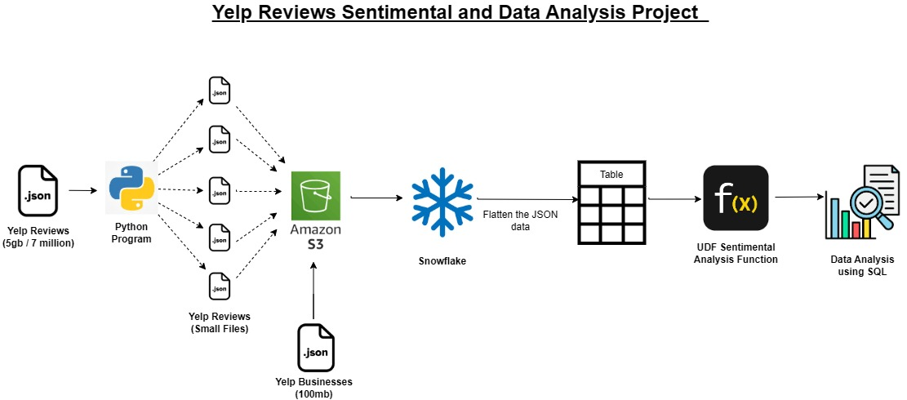

# 🧾 Yelp Business Reviews Analysis

_Analyzing Yelp Business Reviews of the businesses to get better understanding of the customer's sentiments using SQL,Snowflake and Python._

---

## 📌 Table of Contents
- <a href="#overview">Overview</a>
- <a href="#business-problem">Business Problem</a>
- <a href="#workflow">Project Workflow</a>
- <a href="#tools--technologies">Tools & Technologies</a>
- <a href="#repo-structure">Project Repository Structure</a>
- <a href="#AnalysisQuestions">Analysis Questions and Results</a>
- <a href="#author--contact">Author & Contact</a>

---
<h2><a class="anchor" id="overview"></a>Overview</h2>
This project is about analysis of Yelp reviews made by customers for various businesses using SQL queries . 

---
<h2><a class="anchor" id="business-problem"></a>Business 
Problem</h2>

Yelp Reviews paly a vital role in understanding the customer's response for the business:
- Determining which businesses got maximum reviews .
- Determining most active customers on Yelp .
- Determining most famous businesses based on number of reviews.
- Determining businesses with maximum positive reviews .

---
<h2><a class="anchor" id="workflow"></a>Project Workflow</h2>

- Step 1 : Yelp Riviews data containing 7 million in the form of .json was split into 10 smaller files with the help of python function .
- Step 2 : The 10 splited .json files about reviews and 1 .json file about businesses uare saved in a AWS S3 bucket and then loaded into Snowflake tables naming yelp_reviews and yelp_businesses
- Step 3 : These Snowflakes tables are then flatten and from the json data the necessary columns are extracted with proper data type to perform SQL analysis queries .
- Step 4 : In between Step 2 and Step 3 , a new function is also made called sentiment analysis function to get sentiment column in the flatten tables based on the review of the business.

 
---
<h2><a class="anchor" id="tools--technologies"></a>Tools & Technologies</h2>

- SQL ( Snowflake Data ingestion , Data Preparation and Data Analysis Queries )
- Python ( .json data file split function)
- Snowflake ( Platform for Data Storage and Analysis by running queries)
- AWS (S3 bucket storage)

---
<h2><a class="anchor" id="repo-structure"></a>Project Repository Structure</h2>

```
Yelp_Business_Reviews_Analysis_SQL_Snowflake_Python/
│
├── README.md
├── YelpReviewsSplitFilesFunction.ipynb    # Python Function  to split file.
├── Analysis Results          # .csv files of the results of the queries performed in Snowflake.
├── SQL Files /               # .sql files made using Snowflake.
│   ├── Analysis_Questions.sql
│   ├── data_ingestion.sql
    ├── sentiment_analysis_function.sql
    ├── tables_from_json.sql

```

---
<h2><a class="anchor" id="AnalysisQuestions"></a>Analysis Questions and Key Findings</h2>

**Analysis Questions used for queries in the project:**<br>
Q1. Find the number of businesses in each category. <br>
Q2. Find the top 10 users who have reviewed the most businesses in 'restaurant' category.<br>
Q3. Find the most Popular categories of businesses (based on number of reviews).<Br>
Q4. Find top 3 most recent reviews of  each business .<br>
Q5. Find the month with highest number of reviews. <br>
Q6. Find the percentage of 5 star reviews for each business.<br>
Q7. Find the top 5 most reviewed business in each city.<br>
Q8. Find the average rating of the businesses that have atleast 100 reviews.<br>
Q9. List the top 10 users who have written the most reviews , along with business they reviewed.<br>
Q10. Find top 10 businesses with highest positive sentiment reviews.<br>

**Key Findings :** <br>
1.Restaurant , Food and Shopping are the 3 top categories with most businesses registered in our data .<br>
2.Restaurant , Food , Nightlife , Bars and American Traditional are the top 5 categories that got most reviews in our reviews data.<br>
3.Top 5 Businesses with "positive reviews" are :
  Acme Oyster House , Oceana Grill,Hattie B’s Hot Chicken - Nashville , Reading Terminal Market , Ruby Slipper - New Orleans. <br>
4.The average rating of the businesses with atleast 100 reviews ranges from 2 to 4.7 .<br>
5.The number of reviews of top 10 users with maximum reviews ranges from 744  to 1202 in "restaurant category".

---
<h2><a class="anchor" id="author--contact"></a>Author & Contact</h2>

**Gaurav Vajpayee**  
📧 Email: gauravvajpayee99@gmail.com  
🔗 [LinkedIn](https://www.linkedin.com/in/gaurav-vajpayee/)  
🔗 [Portfolio](https://gauravvaj.github.io/AnalyticsPortfolio2.0/)
